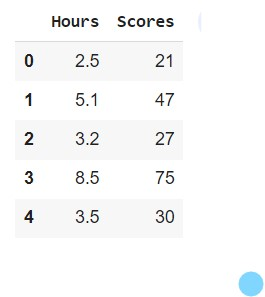
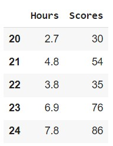
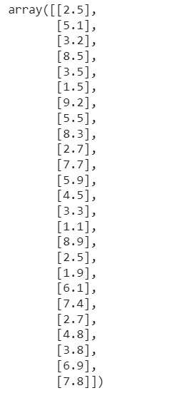
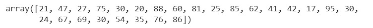
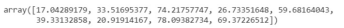
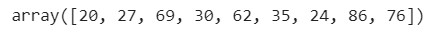
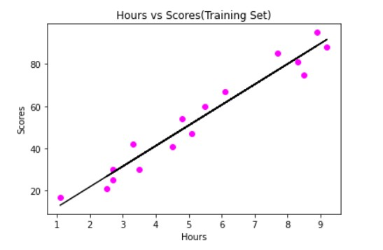
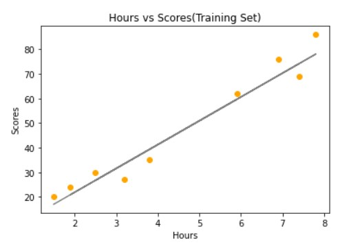
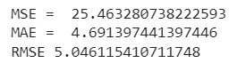

# Implementation-of-Simple-Linear-Regression-Model-for-Predicting-the-Marks-Scored

## AIM:
To write a program to predict the marks scored by a student using the simple linear regression model.

## Equipments Required:
1. Hardware – PCs
2. Anaconda – Python 3.7 Installation / Jupyter notebook

## Algorithm
1. 
2. 
3. 
4. 

## Program:
```
/*
Program to implement the simple linear regression model for predicting the marks scored.
Developed by: Yuvadarshini S
RegisterNumber:  212221230126

import pandas as pd
import numpy as np
import matplotlib.pyplot as plt
from sklearn.metrics import mean_absolute_error, mean_squared_error
df=pd.read_csv('student_scores.csv')
#displaying the content in datafile
dh.head()

df.tail()

#segregating data to variables
x = df.iloc[:,:-1].values
x

y = df.iloc[:,1].values
y

#splitting train and test data
from sklearn.model_selection import train_test_split
x_train,x_test,y_train,y_test =train_test_split(x,y,test_size = 1/3,random_state=0)

from sklearn.linear_model import LinearRegression
regressor=LinearRegression()
regressor.fit(x_train,y_train)
y_pred = regressor.predict(x_test)

#displaying predicted values
y_pred

#displaying actual value
y_test

#graph plot for training data
plt.scatter(x_train,y_train,color="magenta")
plt.plot(x_train,regressor.predict(x_train),color="black")
plt.title("Hours vs Scores(Training Set)")
plt.xlabel("Hours")
plt.ylabel("Scores")
plt.show()

#graph plot for test data 
plt.scatter(x_test,y_test,color="orange") 
plt.plot(x_test,regressor.predict(x_test),color="gray") 
plt.title("Hours vs Scores(Training Set)") 
plt.xlabel("Hours") 
plt.ylabel("Scores") 
plt.show()

mse = mean_squared_error(y_test,y_pred) 
print('MSE = ',mse) 

mae = mean_absolute_error(y_test,y_pred) 
print('MAE = ',mae) 

rmse = np.sqrt(mse) 
print('RMSE',rmse)

*/
```

## Output:











## Result:
Thus the program to implement the simple linear regression model for predicting the marks scored is written and verified using python programming.
